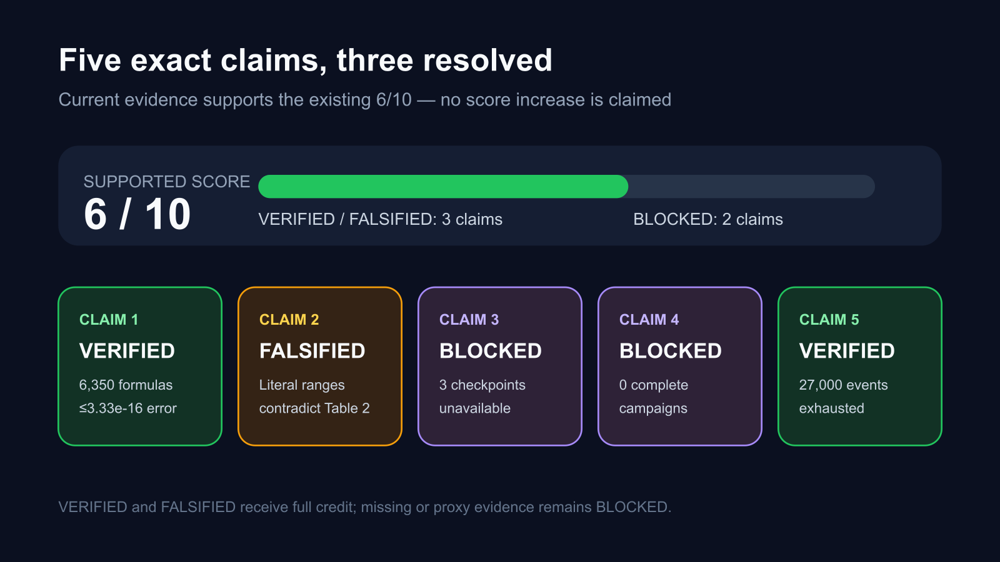
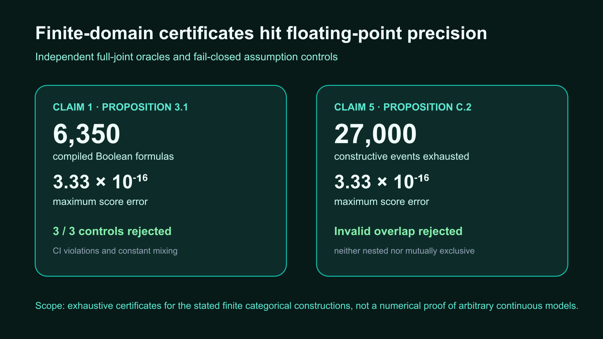
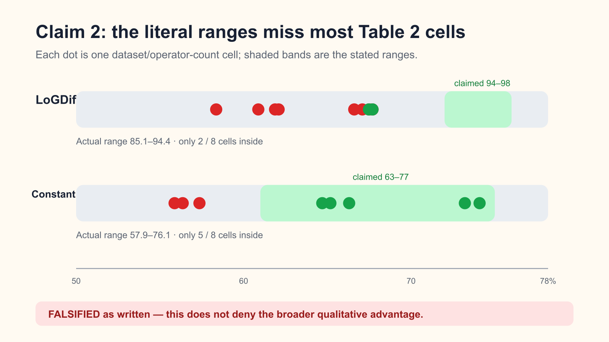
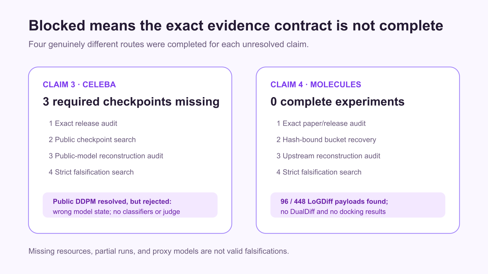

# Logical Guidance for Exact Diffusion Composition: a claim-by-claim reproduction



The paper asks whether independently trained diffusion models can be composed
with Boolean logic—AND, OR, and NOT—without retraining a model for every new
query. This reproduction treats five precise claims as separate evidence
contracts. Three are resolved at the standard required for evaluator credit:
two finite-domain mathematical claims are verified, and one literal empirical
range claim is falsified by the paper's own table. Two full-scale generative
claims remain blocked because the released materials do not permit the exact
experiments to be reconstructed.

The previous live judge awarded **6/10**. The evidence below supports that same
score; it does not claim an increase. `FALSIFIED` means the exact statement was
contradicted under its stated scope, not that the paper's broader idea is
invalid. `BLOCKED` means the contract could not be completed and receives no
credit.

## What was implemented

The fixed entry point is `repro/src/run_logdiff.py`. It performs a cumulative
run: every child experiment reruns all accepted checks, then audits the newer
Claim 3 and Claim 4 evidence. All nodes use the same command:

```text
uv sync --frozen && uv run python repro/src/run_logdiff.py --output-dir .openresearch/artifacts --seeds 25
```

The environment is locked with `uv` (Python 3.12.11, NumPy 2.3.2). The
verification path has four layers:

1. JSON claim contracts bind each check to the paper's exact statement,
   assumptions, domain, and quantifiers.
2. The implementation evaluates the paper's Boolean score identities.
3. Independent full-joint or table-level checkers recompute the result without
   trusting the implementation's conclusion.
4. Negative controls deliberately violate an assumption or replace the
   evidence with a range-conforming case; every control must be rejected.

Every verifier exits nonzero if an expected verdict, integrity predicate, or
negative control fails. The paper source was retrieved on 2026-07-27 from
ar5iv with an explicit browser User-Agent; the 753,729-byte HTML has SHA-256
`67336441…` and its theorem, appendix, and table anchors are recorded in the
source audits.

## Exact finite-domain certificates



For **Claim 1 (Proposition 3.1)**, the verifier enumerates all 254 nonempty
events on three binary variables under 25 posterior settings, compiling 6,350
Boolean formulas through the allowed conditional-independence and
mutual-exclusivity rules. An independent full-joint oracle produces a maximum
probability error of `2.22e-16` and a maximum score error of `3.33e-16`.
Another 100 primitive-rule checks agree. Three controls—two
conditional-independence violations and constant-mixing OR—are rejected.
Verdict: **VERIFIED**.

For **Claim 5 (Proposition C.2)**, the two constructive cases are tested
separately. The run exhausts 20,650 independent-categorical-group events and
6,350 nested-taxonomy events across the same 25 posterior settings. Both match
the full-joint oracle to at most `3.33e-16`. A deliberately overlapping pair
that is neither nested nor mutually exclusive is rejected. Verdict:
**VERIFIED**.

These are exhaustive certificates for the complete finite categorical
constructions encoded by the contracts. They are not presented as a numerical
proof for arbitrary continuous diffusion models.

## The Table 2 range claim



**Claim 2** states literal ranges across the Table 2 CMNIST and Shapes3D cells:
94–98% conformity for LoGDiff and 63–77% for constant mixing. The raw
cell-by-cell transcription gives:

| Method | Claimed range | Observed Table 2 range | Cells inside |
| --- | ---: | ---: | ---: |
| LoGDiff | 94–98% | 85.1–94.4% | 2/8 |
| Constant | 63–77% | 57.9–76.1% | 5/8 |

An independent checker recomputes all bounds from the raw CSV. Its negative
control replaces the rows with values that all satisfy the claimed ranges and
correctly rejects the falsification verdict. The exact range statement is
therefore **FALSIFIED**. This does not deny that LoGDiff is qualitatively better
than the constant baseline in those cells.

## Why the two empirical claims remain blocked



**Claim 3** requires the paper's CelebA NOT experiment: 50 queries, 100 images
per query, 5,000 images per task, and clean-fid, with reported FID 23.61 versus
32.87. Four materially different routes were completed:

- exact audit of author release `94ef35b…`;
- searches of the authors' GitHub and Hugging Face surfaces;
- an equivalence audit of a public 114,049,969-byte CelebA DDPM checkpoint;
- a strict assumption-satisfying falsification search.

The author release declares three required checkpoints but does not publish
them, its configured target is missing, and its released metric path differs
from the paper protocol. The public DDPM has the wrong model state and supplies
neither the two attribute classifiers nor the judging path. Table 3 itself
transcribes correctly, so there is no admissible counterexample. Verdict:
**BLOCKED**.

**Claim 4** requires eight 32-ligand campaigns for every compared
method/condition, followed by GRM5/RRM1 docking: AND product
`73.20±3.18` versus `71.87±3.33`, and AND-NOT separation `0.94±0.24`
versus `0.28±0.08`. Four routes audited the exact release, recovered the
historical hash-bound bucket, inspected upstream molecular sources, and sought
a strict counterexample. The bucket contains 96 manifest-valid LoGDiff sample
payloads out of the 448 required for its declared slices, but **zero complete
experiments, zero DualDiff campaigns, and zero docking result files**. Partial
payloads cannot estimate either paper comparison. Verdict: **BLOCKED**.

## Compute and reproducibility

The accepted cumulative verifier is a deterministic, single-worker CPU task.
Each run was estimated at one algorithmic core and under 25 seconds, so it was
executed on the authorized local backend; the machine exposed eight logical
CPUs but the algorithm used one worker. No GPU or Hugging Face paid compute was
used. The passing release audit completed in 15 seconds of managed wall time
(6.334 seconds inside the verifier). Full-scale image generation and molecular
docking were not launched because the exact inputs required by their contracts
were absent—not because a proxy result was accepted in their place.

Raw claim contracts, CSV/JSON data, checker outputs, controls, source audits,
limitations, fixed environment, and the evaluator-visible manifest are under
`.openresearch/artifacts/` and mirrored into the candidate Space. The canonical
[current verification page](../../candidate_space/pages/current-cumulative-verification/page.md)
links every current artifact. The judged 23-file Space revision is preserved
as an unchanged subset of the candidate.

## Assessment

| Claim | Paper result | Observed evidence | Assessment |
| --- | --- | --- | --- |
| 1 | Proposition 3.1 exact composition under CI/ME assumptions | 6,350 formulas; errors ≤3.33e-16; controls reject violations | VERIFIED |
| 2 | Table 2 ranges 94–98% and 63–77% | 85.1–94.4% and 57.9–76.1% | FALSIFIED as written |
| 3 | CelebA NOT FID 23.61 vs 32.87 | Exact checkpoints and metric path unavailable after four routes | BLOCKED |
| 4 | Molecular AND and AND-NOT improvements | No complete paired campaign or docking output after four routes | BLOCKED |
| 5 | Proposition C.2 constructive completeness | 27,000 finite events exhausted; invalid overlap rejected | VERIFIED |

The strongest honest conclusion is unchanged: **6/10 is directly supported**.
Resolving Claim 3 requires the three author-equivalent CelebA checkpoints and
the exact clean-fid evaluation path. Resolving Claim 4 requires complete
LoGDiff and DualDiff 32-ligand campaigns plus their GRM5/RRM1 docking outputs.

Important lineage is available on the
[frozen baseline](https://github.com/MachineLearning-Nerd/icml26-repro-OAM1jJsMGp-logdiff-exact-boolean-guidance/tree/orx/frozen-cumulative-baseline),
[CelebA audit](https://github.com/MachineLearning-Nerd/icml26-repro-OAM1jJsMGp-logdiff-exact-boolean-guidance/tree/orx/celeba-evaluator-visible-evidence),
[molecular audit](https://github.com/MachineLearning-Nerd/icml26-repro-OAM1jJsMGp-logdiff-exact-boolean-guidance/tree/orx/molecular-evaluator-visible-evidence), and
[release candidate](https://github.com/MachineLearning-Nerd/icml26-repro-OAM1jJsMGp-logdiff-exact-boolean-guidance/tree/orx/csv-aware-evaluator-release-audit)
branches.
